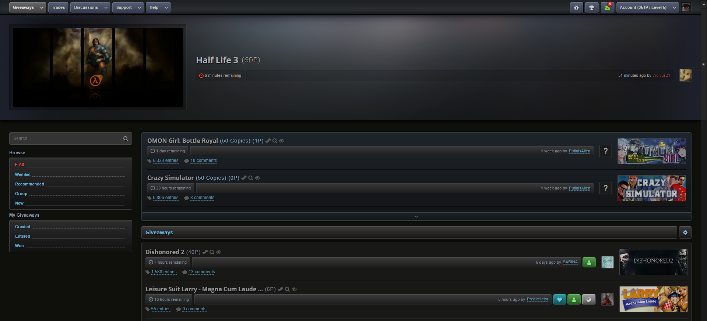

# SGv2-Dark

SGv2 Dark style for [steamgifts.com](https://www.steamgifts.com), [steamtrades.com](https://www.steamtrades.com), [sgtools.info](https://www.sgtools.info). Compatible with most scripts found in the [addon registry](https://gist.github.com/Sighery/99add4143d03eab994efc03776d13c03#file-sg-addons-thread-md)

---
 
## Current Version 1.6.9

## Preview

## Installation

Install [Stylus](https://add0n.com/stylus.html) for either [Firefox](https://addons.mozilla.org/en-US/firefox/addon/styl-us/), [Chrome](https://chrome.google.com/webstore/detail/stylus/clngdbkpkpeebahjckkjfobafhncgmne) or [Opera](https://addons.opera.com/en-gb/extensions/details/stylus/) and then install the style using one of these methods:

📦 [Install the usercss](https://github.com/SquishedPotatoe/SGv2-Dark/raw/master/SGv2-Dark.user.css) which supports automatic updates and customization. 
📦 [Install manually from GitHub](https://github.com/SquishedPotatoe/SGv2-Dark/raw/master/SGv2-Dark.css) with no customization. The style is in Mozilla format. 
📦 [Install script](https://github.com/SquishedPotatoe/SGv2-Dark/raw/master/SGv2-Dark.user.js)  which supports automatic updates but no customization. 